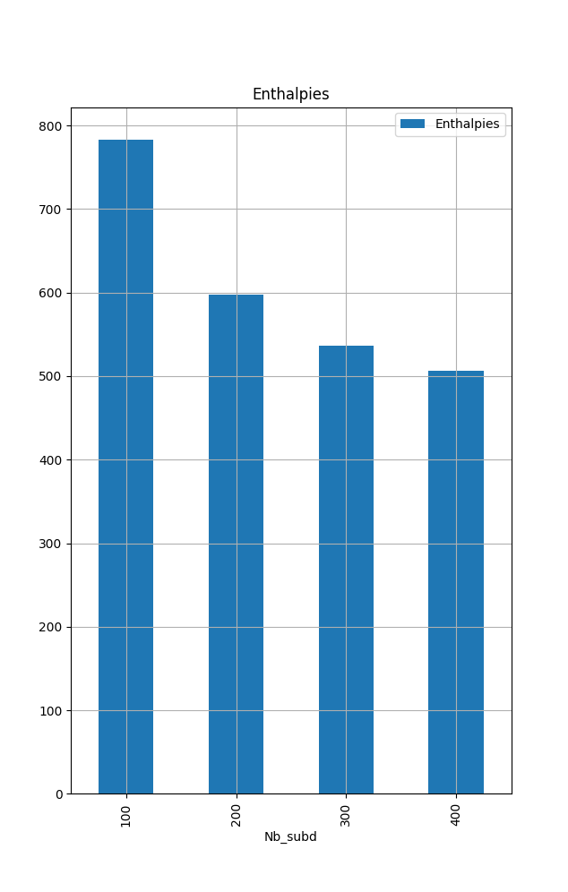

# Etude de l'impact ilots de chaleur urbain

# Objectifs

Etudier l'impact qu'ont les ICU sur la température d'une masse d'air.

# Utilisation

**CF le TL;DR** pour un résumé des étapes pour faire un batch de tests

## Simulation

Compiler le fichier main.c en changeant les paramètres dedans selon ce que l'on veut : `gcc main.c -o main -lm`
Pour lancer une simulation : `./main [args]` avec `[args]` la liste **complète** des arguments listés dans le commentaire présent dans le fichier source (IL N'Y A PAS DE TESTS, SI VOUS METTEZ QQC D'ABSURDE, ON AURA UN SEG FAULT)

## Exploitation

Cela peut alors produire plusieurs fichiers (selon les noms mis en paramètres, et si le `print_to_file` est actif) :
*(Les noms sont des exemples, mais ils correspondent aux noms des paramètres)*
  1. air_temp.tipe : contient chaque température de chaque subdivision de l'air à chaque itération
  2. air_temp_last_first.tipe : contient les mêmes informations mais seulement pour la première et dernière itération
  3. masses_last_first.tipe : de même avec les masses

On peut alors :
  1. **Visulaiser** chaque étape avec `python visualisation_toutes_frame_3d.py` (en changeant les paramètres au préalable)
  2. **Calculer la variation d'enthalpie** avec `python calcul_enthalpie.py` (en changeant les paramètres au préalable)

## Tests

### Faire des tests

/!\ Faire attention que le fichier `tests.txt` soit présent dans `/results/`

Pour lancer un batch de test (différents paramètres etc...) :

  1. Aller dans /tests
  2. Lancer `./run.sh` (ou juste lancer l'instance flask : `flask run`)
  3. Lancer **depuis /tests** `main.py` en ayant au préalable configuré les tests (cf paragraphe plus bas)

### Configuration des tests

Il y a plusieurs moyens de faire des tests, il y a en effet beaucoup de paramètres, donc pour configurer les tests on peut jouer sur tous les paramètres de la simulation, on peut donc créer différentes listes contenant les différentes valeurs que vont prendre chaque paramètre, puis faire un `for` sur ces différentes listes en faisant un appel à `create_test`.
Ensuite, pour ce qui est de la configurabilité des températures des murs et des sols + les différentes valeurs de h, voici la méthode :
Dans le fichier `/config/user_config.txt` placer sur chaque ligne les différentes configurations avec le format décrit dans `/tests/main.py`, les tests prendront en compte chaque configuration.

### Exploiter des tests

Une fois les tests effectués, on peut les exploiter :

  1. **Depuis /tests** lancer `parse_tests.py` en ayant au préalable configuré ce que l'on voulait observer

31 décembre## TL;DR

  1. Mettre dans `user_config.txt` les différentes configurations pour les températures du sol et des différents murs
  2. Se placer dans `/tests/` configurer les tests comme décrit au dessus
  3. Lancer `./run.sh`
  4. Lancer `main.y`
  5. Exploiter

# Exemples

## Simulation

### Une simulation quelconque
https://user-images.githubusercontent.com/40437798/205454906-06ba46fa-2c69-4118-b22b-a38f29bd1a0e.mp4

Avec comme paramètres : `T_e` = 288 K; `Vitesse_air` = 5 km/h; `Volume_air` = 7.5 m³; `Largeur` et `Longueur` = 5 m; `Subdivisions` = 50; `D` = 0.00025; `h` est le même partout : 3 W/K/m²

Et en 3D

https://user-images.githubusercontent.com/40437798/209585508-20b6fe9c-b539-486e-ad69-cfb8fd10b977.mp4

Avec comme paramètres : `T_e` = 288 K; `Vitesse_air` = 0.1 km/h; `Volume_air` = 10000 m³; `Largeur` = 10 m et `Longueur` = 100 m; `Subdivisions` = 50; `D` = 0.00001478969060; `h` est le même partout : 3 W/K/m² (sauf pour là où il n'y a pas de bâtiments sur le mur gauche)

## Exploitation

### Variation d'enthalpie

- Différentes configurations avec les mêmes coefficients de convection et de diffusion (et `offset_floor` = `offset_l_wall` = `offset_r_wall`)
(Attention, je travaillais ici avec une version du projet très ancinne d'où "l'absurdité" de ces valeurs)

- On constate que pour des mêmes données initiales : `T_e` = 288 K; `Vitesse_air` = 5 km/h; `Volume_air` = 10 m³; `Largeur` et `Longueur` = 15 m; `D` très très petit (peut être trop); `h` est le même partout : 3 W/K/m²; selon le nombre de subdivisions, on tend vers une normalisation de la variation d'enthalpie :

# Installation

## Bibliothèques requises

### Python

Pour utiliser la plupart des scripts, il faut `matplotlib`, et `pygame` pour faire la visualisation 3D matrices/matrices et `raylib` pour la visualisation sous forme de "bloc". Pour `parse_tests.py` il faut `pandas`.

### C

Une installation classique de C suffit.

# TODO

## Misc

- [ ] "Continuer meme si fini" argument -> "attendre équilibre" et valeur = cap du nb d'itérations supp

## Tests

- [x] Tout fait
r
## Simulation

- [x] Ajouter le rayonnement réfléchi par parois (albedo)
- [x] Rayonnement infrarouge (corps noir) des murs
- [ ] Refroidir le tout